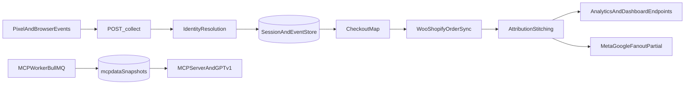

# Resumen tecnico del repositorio para NotebookLM

Este documento consolida el estatus operativo y tecnico actual de `adnova-app` para usarlo como fuente en NotebookLM o en cualquier IA que genere audio explicativo. Incluye objetivo de producto, journeys de usuario, arquitectura, runbook, agentes, comandos, riesgos, glosario, preguntas frecuentes y un inventario sanitizado de configuracion.

**No subas archivos `.env` con valores reales a NotebookLM.** Usa solo este documento y listas de nombres de variables sin secretos.

---

## 1) Estado actual en una vista

- Repositorio principal orientado a ingestion, atribucion y analitica de marketing/ecommerce con foco en Layer 1.
- `README.md` funciona como fuente de verdad y centraliza estado, pipeline canonico, validaciones API/SQL y plan de ejecucion.
- Existe soporte MCP (Phase 1) con endpoints dedicados, tools read-only y guia de integracion con GPT.
- El proyecto depende de submodulos frontend y de una operacion disciplinada de entorno (variables, OAuth, staging/prod).

---

## 2) Objetivo de producto y features principales

### Meta del producto (que problema resuelve)

Construir y operar una **pipeline de atribucion agnostica de plataforma** para Shopify, WooCommerce y sitios custom que:

- Captura eventos del navegador (pixel first-party).
- Hace **stitching** de atribucion (une sesion, checkout y orden).
- Procesa compras del lado del servidor (webhooks / sync).
- Sincroniza la **verdad de revenue** desde las plataformas de ecommerce.
- Expone metricas confiables en el **dashboard**.
- Prepara datos limpios para integraciones **Meta** y **Google**.

Detalle y estado vivo: `README.md` seccion "Product Goal" y "Current Status".

### Layer 1 (foundation): objetivo de entrega

Primera capa completa de captura first-party y atribucion **sin requerir nuevos scopes en Shopify**. Incluye, entre otras cosas:

- Custom Pixel (Customer Events) y collector (`POST /collect`).
- Sync de ordenes en modo **read-only** (revenue truth).
- Stitching base: sesion a checkout a orden; first/last touch; mapeo checkout a orden cuando aplique.
- **Pixel Health**, **match rate** y checklist de onboarding.
- Conexiones **Meta y Google** verificadas: OAuth, lectura basica de gasto y clicks por dia/campaña, **Ads Health**.

Contrato comercial y alcance explicito: `layer1.md`. Modelo de datos por capas: `datos-pixel.md`.

### Features de producto ya descritas en el README (linea base)

- Pixel universal cross-origin, cookie de identidad `_adray_uid`, sesiones y eventos, **checkout map**.
- Ingesta Shopify (webhooks) y Woo (plugin + ruta de sync en backend).
- **Live Feed** en tiempo casi real (SSE), enlace a detalle de sesion.
- **Session Explorer**: timeline, funnel, ordenes ligadas, mapa visual del journey, sesiones relacionadas, comparacion lado a lado, sugerencias de comparacion y lectura longitudinal.
- Vista de atribucion embebida en el dashboard en `/dashboard/attribution`.
- **Paid Media** cuando existe puente entre tienda/usuario y snapshots MCP (`McpData`); degradacion segura si falta vinculo.
- **Historical Conversion Journey** y **Selected Journey** (ver seccion de user journeys y doc de redesign).
- **MCP Phase 1**: ocho tools read-only, OAuth, espejo REST `/gpt/v1/*` para GPT y clientes compatibles.

### Fuera de alcance intencional de Layer 1 (Fase 2 segun `layer1.md`)

- Dedup avanzada, modelos multi-touch complejos, MCP como exposicion total del esquema, parity completo CAPI server-side a plataformas, etc. (ver lista "Fuera de alcance" en `layer1.md`).

---

## 3) User journeys

### 3.1 Comerciante u owner (instalar y confiar en los datos)

1. Onboarding tecnico: instala el pixel o el plugin Woo segun plataforma; asocia la cuenta (snippet con `account_id` segun guia en `README.md` / pixel).
2. Verifica que los eventos llegan: revisa **Pixel Health** y bloques de calidad de datos en el dashboard.
3. Confirma **revenue truth**: ordenes vía webhooks o sync; compara compras recientes con la tienda.
4. Conecta **Meta/Google**; revisa **Integration Health / Ads Health** y, si aplica, **Paid Media**.
5. Operacion: monitoriza **Live Feed**, drill-down a sesiones; ante regresiones, revisa respuestas de `POST /collect` y tabla `failed_jobs` (ver checklist en `README.md`).

### 3.2 Operador o analista (explorar atribucion en el dashboard)

1. Entra a la vista de atribucion embebida: ruta documentada `http://localhost:3000/dashboard/attribution` en flujo local; en produccion, navegacion dentro del shell del dashboard.
2. **Live Feed**: ve eventos en vivo; si hay `sessionId`, abre el detalle de sesion.
3. **Session Explorer**: resumen, funnel, timeline, ordenes; mapa de journey; navegacion entre sesiones del mismo `userKey`; comparacion y tarjetas longitudinales.
4. Perfiles y **Attribution Journey-first**: busqueda y ordenacion de perfiles (consolidado en README como direccion de UX).
5. **Historical Conversion Journey**: conversiones historicas con filtros; pendientes documentados: nombres reales vs placeholders Woo y UX del input de filtro.
6. **Selected Journey**: timeline vertical del usuario o sesion seleccionado; burbujas destacadas **Ad Click** y **Purchase**; metadatos arriba (usuario, confianza, fuente de anuncio, landing); modos **Condensed** y **Full**; detalles en hover. Objetivo pendiente en README: timeline completo cosido, no solo dos hitos. Detalle de implementacion: `docs/selected-journey-redesign-progress.md`.

### 3.3 Comprador final (implicito en el sistema)

- Recorre la tienda; el pixel envia eventos tipicos (`page_view`, `view_item`, `add_to_cart`, `begin_checkout`, `purchase` segun validaciones del README).
- UTMs y click IDs (`gclid`, `fbclid`, etc.) se persisten cuando existen para atribuir la orden sincronizada.

### 3.4 Integrador o IA (MCP / Custom GPT)

- Registra cliente OAuth, obtiene token, prueba las ocho tools vía REST o cliente MCP; guia paso a paso: `docs/MCP_TESTING_AND_GPT_GUIDE.md` y `backend/mcp/README.md`.

---

## 4) Inventario documental (archivos clave)

### Nucleo del producto y operacion

- `README.md`: estado global, arquitectura, pipeline, checklist operativo, riesgos y plan por fases.
- `SETUP.md`: inicializacion de repo + submodulos y comandos de recuperacion.
- `layer1.md`: alcance comercial/funcional de Layer 1, entregables y limites de fase.
- `datos-pixel.md`: modelo de cobertura de datos por capas (1-6) y dependencias de stitching.

### MCP, staging y validacion

- `backend/mcp/README.md`: endpoints MCP/REST mirror, OAuth flow, tools Phase 1 y modo snapshot-first.
- `docs/MCP_TESTING_AND_GPT_GUIDE.md`: guia end-to-end para OAuth, pruebas cURL, tests y conexion con GPT.
- `docs/STAGING_PRODUCTION.md`: checklist de variables, Google OAuth, Render y Cloudflare para release.

### Seguimiento puntual de UX

- `docs/selected-journey-redesign-progress.md`: progreso de redisenio de experiencia "Selected Journey" (no es runbook core).

### Notas de higiene documental

- Se detecta ruta duplicada de `docs/MCP_TESTING_AND_GPT_GUIDE.md` por slash/backslash en algunos listados de herramientas.
- No existe hoy un `docs/README.md` que indexe docs por owner, vigencia y proposito.

---

## 5) Arquitectura tecnica (consolidada)

### Stack principal

- Backend: Node.js + Express (`backend/index.js`).
- Datos: PostgreSQL + Prisma, MongoDB + Mongoose, Redis + ioredis.
- Integraciones: Meta Ads, Google Ads/GA4, Shopify, WooCommerce, Stripe, correo SMTP.
- Frontend: workspaces/submodulos Vite + React + TypeScript (dashboard y landings).
- MCP/LLM: servidor MCP con endpoints `/mcp` y espejo REST `/gpt/v1/*`.

### Flujo canonico de datos

### Responsabilidades funcionales (practicas)

- Ingestion: captura eventos y anchors de identidad.
- Stitching: une eventos/sesiones/orders para atribucion util.
- Snapshoting MCP: prepara data para tools MCP (snapshot-first opcional).
- Exposicion: endpoints dashboard + endpoints MCP/GPT para consumo de producto y IA.

---

## 6) Agentes, reglas y forma de trabajo

### Instrucciones de agente detectadas

- Archivo activo: `Agent-instructions.md`.
- No se encontraron `AGENTS.md`, `.cursor/rules` ni `SKILL.md` dentro del repo.

### Principios operativos definidos

- Leer codigo antes de cambiar arquitectura o flujos.
- Ejecutar cambios pequenos, enfocados y con validacion posterior.
- Tratar `README.md` como source of truth y mantenerlo util (sin ruido).
- Evitar comandos destructivos y no tocar submodulos de forma imprudente.
- Flujo esperado: explorar -> implementar -> actualizar README -> validar -> commit/push.

---

## 7) Comandos y scripts operativos (cuando usar cada uno)

### NPM scripts principales (`package.json`)

| Comando | Uso principal | Cuando correrlo |
|---|---|---|
| `npm start` | Levanta backend | Desarrollo local y smoke rapido |
| `npm run worker:mcp` | Inicia worker BullMQ MCP | Cuando necesitas refrescar snapshots/data MCP |
| `npm run build` | Build integral landing + dashboard + prisma generate | Antes de deploy o validacion de artefactos |
| `npm run build:landing` | Build landing + sync a `public/landing` | Cambios en landing |
| `npm run build:dashboard` | Build dashboard submodulo | Cambios en dashboard |
| `npm run test` / `npm run test:mcp` | Suite Jest MCP | Cambios MCP/OAuth/tools |
| `npm run test:shopify-session` | Smoke de sesiones Shopify | Cambios auth/session embedded |
| `npm run seed:oauth-client` | Seed/update cliente OAuth MCP | Setup local/staging de OAuth MCP |
| `npm run mcp:smoke:staging` | Smoke automatizado MCP en staging | Post-deploy o validacion release |
| `npm run prisma:generate` | Generar cliente Prisma | Tras cambios de schema/build |
| `npm run prisma:migrate` | Migraciones de desarrollo | Evolucion de DB en dev |
| `npm run prisma:deploy` | Aplicar migraciones en deploy | Release con migraciones versionadas |
| `npm run prisma:push` | Sincronizacion rapida schema | Uso controlado, con chequeos de integridad |
| `npm run db:pc:check` | Chequea duplicados en `platform_connections` | Antes de `prisma:push` o ante fallos de unicidad |
| `npm run db:pc:dedupe` | Deduplica `platform_connections` | Solo si el check detecta duplicados |
| `npm run db:backfill:layer45` | Backfill de ordenes/sesiones GA4 | Normalizacion de datos post deploy |
| `npm run db:wipe-tests` | Limpia ordenes de prueba | Limpieza controlada fuera de prod critica |

### Scripts relevantes fuera de package scripts

- `scripts/git-submodules-ci.sh`: soporte de submodulos para CI/automatizacion.
- `scripts/mcp-staging-smoke.js`: smoke MCP en staging.
- `scripts/platform-connections-dedupe.js`: check/aplicacion de dedupe.
- `backend/scripts/backfill-layer45.js`: normalizacion de capas de datos.
- `backend/workers/mcpWorker.js`: worker para jobs MCP.

### Comandos Git operativos documentados

- `git submodule update --init --recursive`: inicializar/sincronizar submodulos a version fijada.
- `git submodule update --remote --merge`: avanzar submodulos a su remoto.
- Comandos destructivos de recuperacion aparecen en `SETUP.md`; usarlos solo con alto control.

---

## 8) Variables de entorno (sanitizadas por dominio)

Importante: esta seccion lista solo nombres de variables detectadas para mapeo tecnico. Nunca incluye valores.

### App y runtime

- `APP_URL`, `SUCCESS_PATH`, `CANCEL_PATH`, `DASH_DEBUG`, `MCP_STAGING_BASE_URL`.

### Seguridad, sesion y acceso interno

- `SESSION_SECRET`, `CRON_KEY`, `INTERNAL_ADMIN_TOKEN`, `MCP_DEV_USER_ID`, `MCP_OAUTH_CLIENT_SECRET`.

### Base de datos y cache

- `DATABASE_URL`, `MONGO_URI`.

### Meta/Facebook

- `FACEBOOK_API_VERSION`, `FACEBOOK_APP_ID`, `FACEBOOK_APP_SECRET`, `FACEBOOK_REDIRECT_URI`, `META_REDIRECT_URI`, `META_CAPI_TEST_CODE`, `META_MAX_ACCOUNTS`.

### Google Ads/OAuth/GA

- `GOOGLE_CLIENT_ID`, `GOOGLE_CLIENT_SECRET`, `GOOGLE_CALLBACK_URL`, `GOOGLE_CONNECT_CALLBACK_URL`.
- `GOOGLE_ADS_LOGIN_CUSTOMER_ID`, `GOOGLE_LOGIN_CUSTOMER_ID`, `GOOGLE_DEVELOPER_TOKEN`, `GADS_API_VERSION`.
- `GOOGLE_CREDENTIALS`, `GOOGLE_SERVICE_ACCOUNT_EMAIL`, `GOOGLE_SERVICE_ACCOUNT_PRIVATE_KEY`, `GOOGLE_SHEETS_ID`.

### Shopify

- `SHOPIFY_API_KEY`, `SHOPIFY_API_SECRET`, `SHOPIFY_API_SECRET_2`, `SHOPIFY_API_VERSION`, `SHOPIFY_APP_HANDLE`, `SHOPIFY_REDIRECT_URI`.

### Facturacion y pagos

- `STRIPE_SECRET_KEY`, `STRIPE_WEBHOOK_SECRET`.
- `FACTURAPI_KEY`, `FACTURAPI_DEFAULT_PAYMENT_FORM`, `FACTURAPI_DEFAULT_PAYMENT_METHOD`, `FACTURAPI_DEFAULT_PRODUCT_CODE`, `FACTURAPI_DEFAULT_UNIT`, `FACTURAPI_DEFAULT_USE`, `FACTURAPI_ISSUER_ZIP`, `FACTURAPI_SERIES`.

### Correo, soporte y contacto

- `SMTP_HOST`, `SMTP_PORT`, `SMTP_USER`, `SMTP_PASS`, `SMTP_FROM`, `SMTP_FROM_NAME`, `SMTP_DEBUG`.
- `BOOKING_URL`, `BOOKING_UR`, `CESAR_CALENDLY_URL`, `CESAR_FROM`, `CESAR_REPLY_TO`, `INTERCOM_APP_ID`, `VITE_INTERCOM_APP_ID`.

### Plataforma anti-bot

- `TURNSTILE_SITE_KEY`, `TURNSTILE_SECRET_KEY`.

### OpenAI

- `OPENAI_API_KEY`, `OPENAI_MODEL_AUDIT`.

---

## 9) Riesgos y brechas actuales

- Riesgo critico: presencia de secretos reales en `.env` local; requiere rotacion y politica de sanitizacion para compartir contexto.
- Riesgo operativo: alta dependencia de submodulos para frontend; si no se actualiza puntero del repo padre, el estado queda inconsistente.
- Riesgo de calidad: no se detectaron workflows en `.github/workflows`, por lo que gran parte de la validacion depende de disciplina manual/scripts.
- Riesgo documental: `README.md` es muy completo pero extenso; mezclar roadmap + runbook + historial complica su mantenimiento.
- Riesgo de despliegue: scripts de DB (`prisma:push`, dedupe, wipe) requieren guardrails estrictos por entorno.

### Prioridad P0 del README (resumen para cierre de audio)

El README lista acciones que deben cerrarse antes de considerar atribucion plenamente confiable en produccion, entre ellas: estabilizar `POST /collect` en produccion, completar fanout real Meta CAPI, verificar subida de conversiones Google end-to-end, eliminar dependencia de fallback inseguro de `ENCRYPTION_KEY`, confirmar rate limiting por `account_id`, pruebas multi-touch Woo y validacion equivalente del pixel Shopify. Ver seccion "Attribution Next Steps" en `README.md` para la lista completa y el orden de trabajo.

---

## 10) Flujo recomendado por entorno

### Local dev

1. Clonar repo y sincronizar submodulos.
2. Configurar `.env` completo (sin commitear secretos).
3. Levantar backend con `npm start`.
4. Levantar worker MCP con `npm run worker:mcp` cuando aplique.
5. Ejecutar pruebas segun cambio (`test:mcp`, `test:shopify-session`).

### Staging

1. Verificar variables y callbacks OAuth (`docs/STAGING_PRODUCTION.md`).
2. Aplicar migraciones/ajustes de datos de forma controlada.
3. Ejecutar `npm run mcp:smoke:staging`.
4. Confirmar checklist API + SQL documentado en `README.md`.

### Produccion

1. Promover solo cambios ya validados en staging.
2. Evitar scripts destructivos sin backup/ventana aprobada.
3. Monitorear ingestion, stitching, failed jobs y frescura de snapshots.

---

## 11) Guion y material para audio (NotebookLM / TTS)

Usa esta seccion como guia cuando pidas a la IA: "genera un podcast / audio explicativo en espanol para un desarrollador nuevo".

### Elevator pitch (aprox. 40 segundos, leible en voz alta)

AdRay, tambien referido como Adnova en el repo, es una plataforma de atribucion para tiendas online. Instala un pixel o un plugin que envia eventos del navegador a un servidor propio. Ese servidor guarda sesiones, enlaza el checkout con la orden que llega por Shopify o WooCommerce, y calcula a que anuncio o campana se puede atribuir la venta. El equipo ve un dashboard con salud del pixel, feed en vivo, explorador de sesiones y paneles de anuncios cuando hay conexion con Meta o Google. Una capa aparte, MCP, expone datos de forma segura a asistentes como ChatGPT para consultas de rendimiento sin mezclar eso con el flujo principal de la tienda.

### Tres voces cortas (para storytelling)

- **Comerciante:** "Instalo el snippet, veo que los eventos entran, reviso que las ventas cuadren y que Meta y Google aparezcan conectados."
- **Operador:** "Abro el dashboard, sigo el Live Feed, abro una sesion y recorro el journey; si algo falla, miro jobs fallidos y el collector."
- **Ingeniero:** "Levanto el backend, configuro env, corro tests MCP o smoke de Shopify segun el cambio, y sigo el README como checklist antes de desplegar."

### Mapa de pantallas y bloques (dashboard / atribucion)

| Bloque o ruta | Para que sirve (oral) |
|---|---|
| `/dashboard/attribution` | Vista principal de analitica de atribucion dentro del shell del dashboard. |
| Live Feed | Eventos recientes en tiempo casi real; clic con session abre detalle. |
| Session Explorer | Panel persistente: resumen, funnel, timeline, ordenes, mapa de journey, comparacion de sesiones. |
| Paid Media | Gasto y retorno desde snapshots MCP cuando la tienda esta vinculada a datos de anuncios. |
| Pixel Health / calidad | Confirma que el pixel y la ingesta funcionan. |
| Historical Conversion Journey | Lista historica de conversiones con filtros; mejoras de UX y nombres pendientes segun README. |
| Selected Journey | Timeline vertical del usuario elegido; modos Condensado y Completo; foco en clic en anuncio y compra. |

### Glosario (definir al primer uso en audio)

- **Atribucion:** atribuir una venta a un canal o campana segun eventos y datos de anuncio.
- **Pixel / collector:** script en la tienda que envia eventos a `POST /collect` en el backend AdRay.
- **Stitching:** unir identidad, sesion, checkout y orden en un relato coherente.
- **Checkout map:** registro que guarda la atribucion en el momento del checkout.
- **Revenue truth:** la orden y el monto que vienen del ecommerce como fuente de verdad.
- **Layer 1:** primera fase entregable: pixel, collector, sync de ordenes, stitching base, salud y ads basicos.
- **Merchant snapshot:** resumen persistido del estado del comercio para el dashboard.
- **MCP:** protocolo para que un asistente de IA consulte datos del negocio con tools controladas.
- **Snapshot-first:** servir datos MCP desde copias precomputadas cuando aplica, para estabilidad y coste.
- **SSE:** Server-Sent Events, usado en Live Feed para empujar eventos al navegador.
- **Prisma / PostgreSQL:** base relacional principal del pipeline.
- **MongoDB:** modulos operativos y legado, incluido OAuth clients para MCP.
- **BullMQ / Redis:** colas y worker para jobs MCP.
- **Submodulo:** repo Git anidado (por ejemplo `dashboard-src`) que el padre fija a un commit concreto.

### Preguntas frecuentes (FAQ para recuperacion en NotebookLM)

1. **Que es este repositorio?** Monorepo backend + scripts + integracion con frontends en submodulos; nucleo en Node, Express, Prisma y Mongo segun modulo.
2. **Donde esta la verdad del estado del proyecto?** En `README.md`, actualizado por el equipo al cerrar mejoras relevantes.
3. **Que es Layer 1 frente a Fase 2?** Layer 1 entrega captura, revenue read-only, stitching base y conexiones ads basicas; Fase 2 amplia dedup, MCP completo, CAPI pleno, etc., segun `layer1.md`.
4. **Como entra un evento de la tienda?** Pixel -> `POST /collect` -> persistencia en PostgreSQL segun el modelo canonico del README.
5. **Que es Selected Journey?** Vista de timeline vertical del usuario/sesion seleccionado; ver `docs/selected-journey-redesign-progress.md`.
6. **Como pruebo MCP en staging?** `npm run mcp:smoke:staging` y la guia `docs/MCP_TESTING_AND_GPT_GUIDE.md`.
7. **Que comando levanta solo el API?** `npm start`.
8. **Cuando necesito el worker MCP?** Cuando debas poblar o refrescar datos para las tools MCP (BullMQ + Redis + Mongo).
9. **Puedo subir mi `.env` a NotebookLM?** No, si contiene secretos; usa este archivo y nombres de variables sin valores.
10. **Que hago si `prisma:push` falla por duplicados?** `npm run db:pc:check` y, si aplica, `db:pc:dedupe` con precaucion.
11. **Donde esta la checklist de deploy?** `README.md` (Operational Checklist) y `docs/STAGING_PRODUCTION.md`.
12. **Que reglas siguen los agentes de IA en el repo?** `Agent-instructions.md`: cambios minimos, README como fuente de verdad, sin comandos destructivos ni tocar submodulos a la ligera.

### Prompt sugerido para generar audio en NotebookLM

Copia y adapta la duracion:

> Con las fuentes cargadas, genera un audio en espanol de 10 a 15 minutos para un desarrollador que va a trabajar en AdRay. Estructura: (1) que problema resuelve el producto y para quien, (2) Layer 1 y lo que ya funciona segun el README, (3) recorrido del comerciante y del operador en el dashboard, (4) pipeline tecnico en lenguaje sencillo del pixel a la orden, (5) MCP y para que sirve, (6) comandos clave npm y cuando usarlos, (7) riesgos P0 y como validar en staging. Define cada termino tecnico la primera vez que lo digas. Tono: claro, profesional, sin marketing vacio.

### Audio en dos partes (si el modelo se satura)

- **Parte A:** producto, journeys, pantallas, glosario corto.
- **Parte B:** arquitectura, comandos, variables por dominio, MCP, checklist y P0.

---

## 12) Paquete recomendado para NotebookLM (source pack)

Orden sugerido de fuentes al subir archivos:

1. `README.md`
2. Este archivo: `docs/NOTEBOOKLM_REPO_STATUS.md`
3. `backend/mcp/README.md`
4. `docs/MCP_TESTING_AND_GPT_GUIDE.md`
5. `docs/STAGING_PRODUCTION.md`
6. `datos-pixel.md`
7. `layer1.md`
8. `SETUP.md`
9. `Agent-instructions.md`
10. `docs/selected-journey-redesign-progress.md`

No incluyas `.env` con valores reales.

---

## 13) Acciones inmediatas recomendadas

- Crear `docs/README.md` con indice, owner y fecha de revision por documento.
- Separar en `README.md` el bloque de runbook operativo del bloque de roadmap para reducir deuda de mantenimiento.
- Definir politica minima para secretos (plantilla `.env.example`, rotacion, checklist pre-compartir).
- Incorporar al menos un pipeline CI basico para tests MCP y smoke de scripts criticos.
