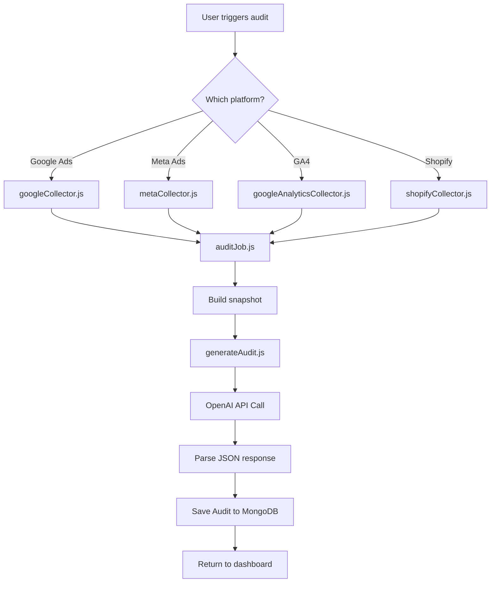

# ADNOVA-APP Repository Deep Dive Walkthrough

## Executive Summary

**ADNOVA AI** (branded as **ADRAY**) is a SaaS platform for AI-powered marketing audit generation. It connects to multiple advertising and analytics platforms (Google Ads, Meta/Facebook Ads, Google Analytics 4, Shopify, WooCommerce), collects performance data, and uses OpenAI GPT models to generate actionable audit reports with findings and recommendations.

---

## Technology Stack

| Layer | Technology |
|-------|------------|
| **Runtime** | Node.js 18+, Express 5 |
| **Database** | MongoDB Atlas (Mongoose ODM) |
| **Queue/Cache** | Redis (ioredis), BullMQ |
| **Authentication** | Passport.js (Google OAuth, session-based) |
| **Payments** | Stripe (subscriptions, checkout) |
| **Invoicing** | Facturapi (Mexican CFDI tax invoices) |
| **AI/LLM** | OpenAI API (GPT-4o-mini default) |
| **Email** | Nodemailer (SMTP) |
| **Deployment** | Render.com |

---

## Directory Structure

```
adnova-app/
├── backend/                    # Main server codebase
│   ├── index.js                # Express app entry point (~824 lines)
│   ├── auth.js                 # Passport Google OAuth strategy
│   ├── models/                 # Mongoose schemas (7 models)
│   ├── routes/                 # API route handlers (26+ files)
│   ├── services/               # Business logic services (5 files)
│   ├── jobs/                   # Background processing
│   │   ├── auditJob.js         # Audit orchestration
│   │   ├── collect/            # Data collectors per platform
│   │   └── llm/                # OpenAI audit generation
│   └── utils/                  # Helpers
├── middlewares/                # Express middleware
│   ├── csp.js                  # Content Security Policies
│   ├── verifySessionToken.js   # Session validation
│   └── verifyShopifyToken.js   # Shopify token validation
├── public/                     # Static frontend assets
│   ├── landing/                # Marketing site
│   ├── dashboard/              # Legacy dashboard (fallback)
│   ├── onboarding.html         # User onboarding flow
│   ├── login.html              # Auth pages
│   ├── plans/                  # Pricing/subscription pages
│   ├── connector/              # Shopify embed interface
│   └── support/                # Help/support pages
├── dashboard-src/              # Git submodule (SPA dashboard)
├── docs/                       # Documentation
├── package.json                # Dependencies
├── server.js                   # Alternative entry point
└── render.yaml                 # Deployment config
```

---

## Data Models

### 1. User (`backend/models/User.js`)

The core user model with:

- **Authentication**: email/password (bcrypt hashed), Google OAuth
- **Platform Connections**: Shopify, Google, Meta status flags
- **Subscription**: Stripe integration with plan tiers (`gratis`, `emprendedor`, `crecimiento`, `pro`, `enterprise`)
- **Preferences**: Selected accounts for Google Ads, GA4, Meta Ads auditing
- **Password Reset**: Token-based recovery

```javascript
{
  email, password, onboardingComplete,
  shop, shopifyConnected, shopifyAccessToken,
  googleConnected, metaConnected,
  selectedMetaAccounts, selectedGoogleAccounts,
  stripeCustomerId, plan, subscription: { id, status, priceId, plan, currentPeriodEnd }
}
```

### 2. Audit (`backend/models/Audit.js`)

Stores generated audit reports:

- **Types**: `google` (Ads), `meta`, `shopify`, `ga4`
- **Content**: summary, issues array with severity/area classification
- **Metadata**: origin (manual/onboarding/panel), plan, maxFindings, inputSnapshot
- **Areas**: setup, performance, creative, tracking, budget, bidding
- **Severity**: alta/media/baja (normalized from english variants)

### 3. GoogleAccount (`backend/models/GoogleAccount.js`)

Stores Google OAuth tokens and discovered accounts:

- **Tokens**: accessToken, refreshToken (encrypted, select: false)
- **Google Ads**: customers array, ad_accounts, loginCustomerId
- **GA4**: gaProperties array with propertyId, displayName
- **Selection**: selectedCustomerIds for auditing

### 4. MetaAccount (`backend/models/MetaAccount.js`)

Similar structure for Facebook/Meta:

- **Tokens**: longLivedToken (60-day), multiple legacy aliases
- **Ad Accounts**: ad_accounts array with account_id, name, currency
- **Selection**: selectedAccountIds

### 5. ShopConnections (`backend/models/ShopConnections.js`)

Minimal Shopify OAuth storage:
```javascript
{ shop, accessToken, installedAt, matchedToUserId }
```

### 6. WooConnections (`backend/models/WooConnections.js`)

WooCommerce plugin connections:
```javascript
{ shop, accessToken, pluginVersion, adminEmail, installedAt, matchedToUserId }
```

### 7. TaxProfile (`backend/models/TaxProfile.js`)

Mexican tax invoicing (SAT/CFDI):
```javascript
{ user, rfc, name, email, cfdiUse, taxRegime, zip, isCompany }
```

---

## Core Features

### 1. AI-Powered Audit Generation

The audit pipeline flow:



**Key Files:**
- [auditJob.js](file:///c:/Users/pooln/Documents/GitHub/adnova-app/backend/jobs/auditJob.js) - Orchestrates data collection and audit generation
- [generateAudit.js](file:///c:/Users/pooln/Documents/GitHub/adnova-app/backend/jobs/llm/generateAudit.js) - OpenAI prompt engineering and JSON parsing

**Plan-Based Limits:**
```javascript
PLAN_MAX_FINDINGS = {
  gratis: 5,       // 1 audit/month
  emprendedor: 8,  // 3 audits/month
  crecimiento: 10, // 1 audit/week
  pro: 15,         // Unlimited
}
```

### 2. Multi-Platform OAuth Integration

#### Google (Ads + GA4)
- Endpoint: `/auth/google/connect`
- Scopes: `adwords`, `analytics.readonly`
- Discovers accessible customer IDs and GA4 properties
- Stores in `GoogleAccount` model

#### Meta/Facebook
- Endpoint: `/auth/meta/connect`
- Scopes: `ads_read`, `ads_management`, `business_management`
- Exchanges short-lived → long-lived tokens (60 days)
- Stores in `MetaAccount` model

#### Shopify
- Embedded app flow via `/connector`
- OAuth with HMAC validation
- Stores in `ShopConnections` model
- CSP configured for iframe embedding from Shopify Admin

### 3. Stripe Subscription Billing

**Checkout Flow:**
1. User selects plan → POST `/api/stripe/checkout`
2. Creates/reuses Stripe Customer
3. Generates checkout session with metadata
4. Redirect to Stripe checkout
5. On success → `/plans/success` + webhook processing

**Webhook Events Handled:**
- `checkout.session.completed`
- `customer.subscription.created/updated/deleted`
- `invoice.paid` → Auto-generates Mexican CFDI invoice via Facturapi

**Price IDs:**
- `emprendedor`: env `STRIPE_PRICE_ID_EMPRENDEDOR`
- `crecimiento`: env `STRIPE_PRICE_ID_CRECIMIENTO`
- `pro`: env `STRIPE_PRICE_ID_PRO`

### 4. Mexican Invoicing (Facturapi)

Automatic CFDI generation on invoice payment:
- Uses customer's TaxProfile (RFC, name, cfdiUse)
- Sends invoice PDF via email
- Stores `lastCfdiId` on user subscription

---

## API Routes Reference

### Authentication
| Method | Path | Description |
|--------|------|-------------|
| GET | `/auth/google/login` | Google OAuth login |
| GET | `/auth/google/connect` | Connect Google Ads/GA4 |
| GET | `/auth/meta/connect` | Connect Facebook Ads |
| POST | `/api/register` | Email/password registration |
| POST | `/api/login` | Email/password login |
| POST | `/api/logout` | Logout + session destroy |
| GET | `/api/session` | Current session info |
| GET | `/api/me` | User profile + subscription |

### Audits
| Method | Path | Description |
|--------|------|-------------|
| GET | `/api/audits/usage` | Check audit quota |
| POST | `/api/audits/start` | Generate all-platform audit |
| POST | `/api/audits/source/:source` | Generate single-source audit |
| GET | `/api/audits/latest` | Latest audits per type |
| GET | `/api/audits/:id` | Get specific audit |

### Platform APIs
| Method | Path | Description |
|--------|------|-------------|
| GET | `/api/google/analytics/*` | GA4 data endpoints |
| GET | `/api/google/ads/insights` | Google Ads insights |
| GET | `/api/meta/insights` | Meta Ads insights |
| GET | `/api/meta/accounts` | Meta ad accounts |
| GET | `/api/shopify/*` | Shopify data |

### Billing
| Method | Path | Description |
|--------|------|-------------|
| POST | `/api/stripe/checkout` | Create checkout session |
| POST | `/api/stripe/webhook` | Stripe webhook handler |
| GET | `/api/billing/portal` | Customer billing portal |
| POST | `/api/facturapi/generate` | Manual invoice generation |

### Shopify Connector
| Method | Path | Description |
|--------|------|-------------|
| GET | `/connector` | Entry point (forces OAuth) |
| GET | `/connector/auth/callback` | OAuth callback |
| GET | `/connector/interface` | Embedded app UI |
| POST | `/connector/webhooks` | Shopify webhooks |

---

## Security Configuration

### CORS
```javascript
ALLOWED_ORIGINS = [
  'https://adray.ai',
  'https://admin.shopify.com',
  /^https?:\/\/[^/]+\.myshopify\.com$/i,
  'http://localhost:3000',
  'http://localhost:5173',
]
```

### Content Security Policy

**Public pages**: Standard CSP with Calendly for scheduling

**Shopify embed**: Relaxed CSP allowing:
- `frame-ancestors: admin.shopify.com, *.myshopify.com`
- `script-src: cdn.shopify.com` (for App Bridge)

### Session
- `express-session` with secure cookies
- `sameSite: 'none'` in production (cross-site Shopify embed)
- `httpOnly: true`

---

## Environment Variables

### Core
```bash
PORT=3000
NODE_ENV=development|production
MONGO_URI=mongodb+srv://...
SESSION_SECRET=...
```

### Google
```bash
GOOGLE_CLIENT_ID=...
GOOGLE_CLIENT_SECRET=...
GOOGLE_REDIRECT_URI=...
```

### Meta
```bash
META_APP_ID=...
META_APP_SECRET=...
```

### Shopify
```bash
SHOPIFY_API_KEY=...
SHOPIFY_API_SECRET=...
SHOPIFY_SCOPES=read_products,read_orders,...
```

### Stripe
```bash
STRIPE_SECRET_KEY=sk_...
STRIPE_WEBHOOK_SECRET=whsec_...
STRIPE_PRICE_ID_EMPRENDEDOR=price_...
STRIPE_PRICE_ID_CRECIMIENTO=price_...
STRIPE_PRICE_ID_PRO=price_...
```

### OpenAI
```bash
OPENAI_API_KEY=sk-...
OPENAI_MODEL_AUDIT=gpt-4o-mini  # Optional override
```

### Email
```bash
SMTP_HOST=smtp.gmail.com
SMTP_PORT=465
SMTP_USER=...
SMTP_PASS=...
SMTP_FROM=...
```

### Facturapi (Mexico)
```bash
FACTURAPI_API_KEY=...
FACTURAPI_DEFAULT_USE=G03
```

---

## Deployment

Configured for **Render.com** via `render.yaml`:
```yaml
services:
  - type: web
    name: adnova-ai
    env: node
    buildCommand: npm install
    startCommand: node backend/index.js
    envVars:
      - key: NODE_VERSION
        value: 18
```

---

## WooCommerce Integration (POC)

A proof-of-concept WooCommerce plugin connector exists:

**Install Flow:**
1. Plugin POSTs to `/api/woocommerce/install` with `{ shopDomain, adminEmail, pluginVersion }`
2. Server generates token, stores in `WooConnections`
3. Plugin stores token for webhook authorization

**Webhook Flow:**
- Plugin registers webhooks to `/api/woocommerce/webhook`
- Includes `Authorization: Bearer <token>` header
- Events: `order.created`, `product.updated`, `customer.created`

---

## Key Code Patterns

### Normalization Hooks
All models use `pre('save')` hooks for data normalization:
- Strip prefixes (`act_`, `customers/`, `properties/`)
- Deduplicate arrays
- Normalize severity/impact values

### Token Security
Sensitive fields use `select: false`:
```javascript
accessToken: { type: String, select: false }
```
Explicit projection required:
```javascript
GoogleAccount.findOne(query).select('+accessToken +refreshToken')
```

### Plan-Based Feature Gates
```javascript
const cfg = PLAN_CONFIG[user.plan] || PLAN_CONFIG.gratis;
if (!cfg.unlimited && used >= cfg.limit) {
  return res.status(403).json({ error: 'LIMIT_REACHED' });
}
```

---

## Summary

ADNOVA/ADRAY is a comprehensive marketing audit SaaS with:

- ✅ Multi-platform OAuth (Google Ads, GA4, Meta, Shopify)
- ✅ AI-powered audit generation (OpenAI GPT-4o-mini)
- ✅ Subscription billing (Stripe) with tier-based limits
- ✅ Mexican tax invoicing (Facturapi CFDI)
- ✅ Shopify embedded app support
- ✅ WooCommerce integration (POC stage)
- ✅ Secure session management with CORS/CSP protection
